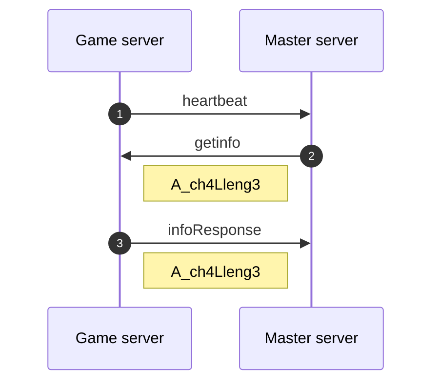
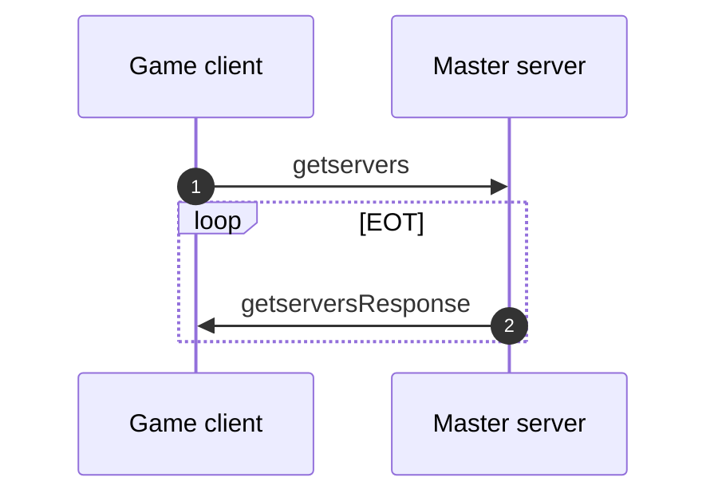

# Implementation status

| message                 | serialize | deserialize |
| ----------------------- | :-------: | :---------: |
| `heartbeat`             | ✓         | ✓         |
| `getinfo`               | ✓         | ✓         |
| `infoResponse`          | ✓         | ✓         |
| `getservers`            | ✓         | ✓         |
| `getserversResponse`    | ✓         | ✓         |
| `getserversExt`         | ❌         | ❌         |
| `getserversExtResponse` | ❌         | ❌         |

## Message flows

Lorem ipsum.

### `heartbeat` message flow

❶ Game server sends `heartbeat` message to master server

❷ Master server sends `getinfo` message with new challenge back to game server

❸ Game server sends `infoResponse` message with same challenge back to master server

### `getservers` message flow

❶ Game client sends `getservers` message to master server

❷ Master server sends `getserversResponse` message(s) back to game client

