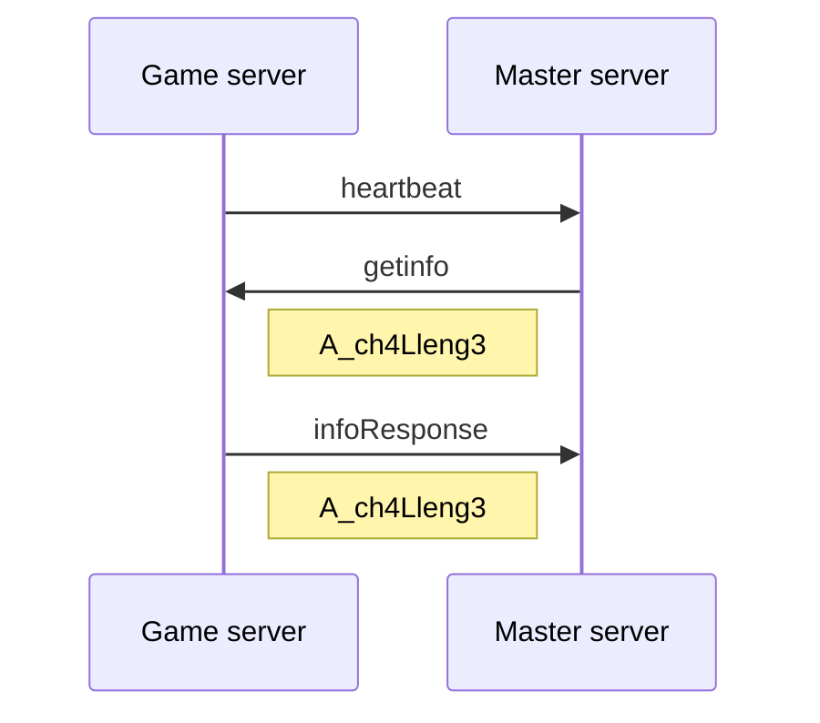
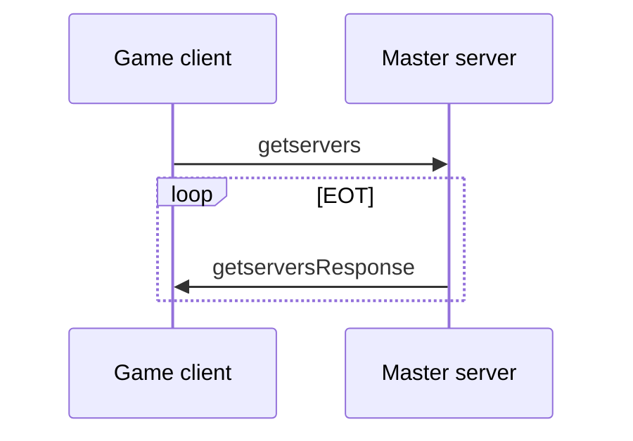

| message                 | serialize | deserialize |
| ----------------------- | :-------: | :---------: |
| `heartbeat`             | ✓         | ✓         |
| `getinfo`               | ✓         | ✓         |
| `infoResponse`          | ✓         | ✓         |
| `getservers`            | ✓         | ✓         |
| `getserversResponse`    | ✓         | ✓         |
| `getserversExt`         | ❌         | ❌         |
| `getserversExtResponse` | ❌         | ❌         |

